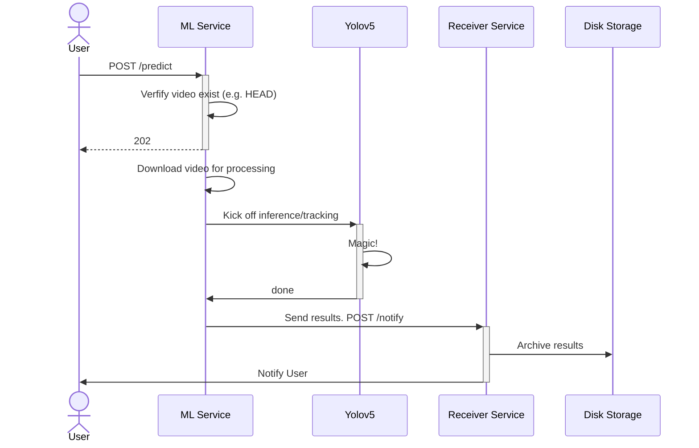

```mermaid
sequenceDiagram
	actor U as User
	participant M as ML Service
	participant Y as Yolov5
	participant R as Receiver Service
	participant D as Disk Storage

	U->>+M: POST /predict
	M->>M: Verfify video exist (e.g. HEAD)
	M-->>-U: 202
	M->>M: Download video for processing
	M->>+Y: Kick off inference/tracking
	Y->>Y: Magic!
	Y->>-M: done
	M->>+R: Send results. POST /notify
	R->>D: Archive results
	R->>-U: Notify User
```
